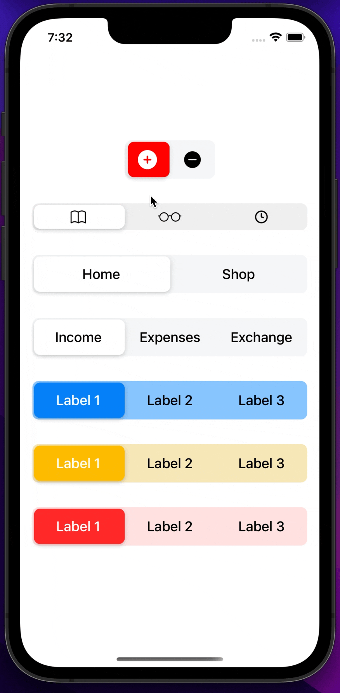

[](https://github.com/WrathChaos/react-native-segmented-control-2)

[](https://www.npmjs.com/package/react-native-segmented-control-2)
[](https://www.npmjs.com/package/react-native-segmented-control-2)

[](https://opensource.org/licenses/MIT)
[](https://github.com/prettier/prettier)

<p align="center">
  
</p>

# Installation

Add the dependency:

```bash
npm i react-native-segmented-control-2
```

## Peer Dependencies

<b><i>Zero Dependency</i></b> 🥳

# Usage

## Import

```jsx
import SegmentedControl from "react-native-segmented-control-2";
```

## Fundamental Usage

```jsx
<SegmentedControl
  tabs={["Label 1", "Label 2", "Label 3"]}
  onChange={(index: number) => console.log("Index: ", index)}
/>
```

## Customized Usage

```jsx
<SegmentedControl
  style={{ marginTop: 32, backgroundColor: "#ffe0e0" }}
  activeTabColor="#ff2929"
  activeTextColor="#fff"
  tabs={["Label 1", "Label 2", "Label 3"]}
  onChange={(index: number) => console.log("Index: ", index)}
/>
```

### Any Component Usage

You can use the segmented control with any component.
All you need to do is that put any component into the `tabs` props.
Please check out the `example` for its usage

## Example Project 😍

You can checkout the example project 🥰

Simply run

- `npm i`
- `react-native run-ios/android`

should work of the example project.

# Configuration - Props

## Fundamentals

| Property |   Type   |  Default  | Description                                          |
| -------- | :------: | :-------: | ---------------------------------------------------- |
| tabs     |  any[]   | undefined | set the array for tabs                               |
| onChange | function | undefined | set your own logic when the tab is pressed / changed |

## Customization (Optionals)

| Property         |   Type    |      Default       | Description                                             |
| ---------------- | :-------: | :----------------: | ------------------------------------------------------- |
| style            | ViewStyle |      default       | set or override the style object for the main container |
| width            |  number   | ScreenWidth \* 0.9 | change the width of the main segmented control          |
| initialIndex     |  number   |         0          | set the initial index                                   |
| activeTextColor  |  string   |        #000        | change the active tab's text color                      |
| activeTabColor   |  string   |        #FFF        | change the active tab's color                           |
| extraSpacing     |  number   |         0          | set extra spacing for animation horizontal value        |
| tabStyle         | ViewStyle |      default       | set or override the style object for the tab            |
| selectedTabStyle | ViewStyle |      default       | set or override the style object for the selected tab   |
| textStyle        | TextStyle |      default       | set or override the style object for tab's text         |

## Future Plans

- [x] ~~LICENSE~~
- [ ] Write an article about the lib on Medium

## Credits

Heavily inspired by these libraries:

- [react-native-segmented-control/segmented-control](https://github.com/react-native-segmented-control/segmented-control)
- [Karthik-B-06/react-native-segmented-control](https://github.com/Karthik-B-06/react-native-segmented-control)

I created this library because they're really not maintain actively and this is a pure javascript written library

## Author

FreakyCoder, kurayogun@gmail.com

## License

React Native Segmented Control 2 is available under the MIT license. See the LICENSE file for more info.
